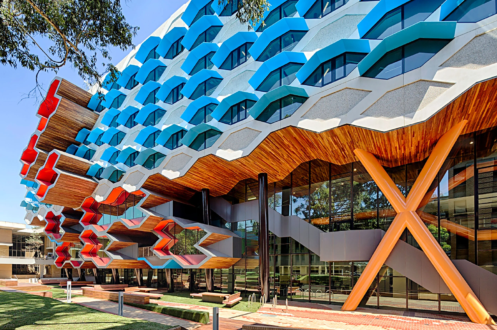

   

- **Dates**: Monday November 17 - Tuesday November 18, 2025. 
- **Venue**: La Trobe University City campus, Melbourne.

The main aim of the annual Australian Algebra Conference is to foster communication between algebraists in Australia. We interpret algebra quite broadly, including areas such as topological algebra, algebraic logic, graph theory and coding theory. The conference is run by the [Australian Algebra Group](https://sites.google.com/a/ltumathstats.com/austalg/about-us), which is a special interest group of the [Australian Mathematical Society](https://austms.org.au/).

The conference has a proud tradition of encouraging talks by students: typically about one third of the talks are presented by students. The conference aims to provide graduate students in algebra with the opportunity to give their first public presentation in a relaxed and supportive environment. Each conference, the most outstanding student talk is awarded the [Gordon Preston Prize](https://sites.google.com/a/ltumathstats.com/austalg/gordon-preston-prize).

## Jump to
<a href="#schedule">Schedule, Transport and Information</a> 
<a href="#inv-sp">Invited speakers</a> 
<a href="#rego">Registration</a> 
<a href="#dead">Deadlines</a> 
<a href="#talks">Talks</a> 
<a href="#local">Local Information</a> 
<a href="#them">Registered Participants</a> 
<a href="#us">Organisers</a> 

<h2 id="photo">Conference photo</h2>

<h2 id="schedule">Schedule, Transport and Information Booklet</h2>

<h2 id="inv-sp">Invited speakers</h2>

To be announced.

<h2 id="rego">Registration</h2>

Registration is now open.

Please see below for the schedule of conference registration fees.

<html>
<table class="unstyledTable">
<thead>
<tr>
<th>Category</th>
<th>Fee</th>
</tr>
</thead>
<tbody>
<tr>
<td>Students</td>
<td>$0</td>
</tr>
<tr>
<td>Members of the Australian Algebra Group (AAG)</td>
<td>$0</td>
</tr>
<tr>
<td>Members of AustMS but not AAG</td>
<td>$30</td>
</tr>
<tr>
<td>Non-members</td>
<td>$40</td>
</tr>
</tbody>
</table>
</html>

Registration fees should be paid via bank transfer - more details will be emailed to you once you register.

We will have an individually funded conference dinner at the AAA pub on Tuesday 18th November.

There is limited travel support available for students. If you would like to apply for this support, please email [Santiago Barrera Acevedo](mailto:s.barreraacevedo@latrobe.edu.au?subject=Student%20funding%20application%20for%20AAC) with a letter of support from your supervisor and an approximate budget of your expenses.

The allocation of funding will be communicated to applicants before registration closes.

<!-- **To register, please fill in [this form](https://forms.gle/HifdrEdRzJRnovBd6).** -->

<h2 id="dead">Deadlines</h2>

**Travel support applications due:** 29th September 2023

**Registration closes:** 3rd November 2023

**Abstract deadline:** 3rd November 2023

<h2 id="talks">Talks</h2>

## Gordon Preston Prize

The [Gordon Preston Prize](https://sites.google.com/a/ltumathstats.com/austalg/gordon-preston-prize) is awarded for the best presentation at the AAC given by a current student based at an Australian or overseas university. The presentations will be judged by a panel appointed by the executive committee. The winner of the prize will receive $300. [The Rules](https://sites.google.com/a/ltumathstats.com/austalg/rules-for-the-gordon-preston-prize) for the Gordon Preston Prize are available on the website of the Australian Algebra Group. 

<h2 id="local">Local Information</h2>

<html>
<head>
	<meta http-equiv="content-type" content="text/html; charset=utf-8">
</head>
<body>

	The conference will be held at the La Trobe University city campus.

	All talks will be held in Room AAA 

<h2 id="them">Registered Participants</h2>
<table class="tg">
<thead>
  <tr>
    <th class="tg-0lax">Name</th>
    <th class="tg-0lax">Affiliation</th>
  </tr>
</thead>
<tbody>
  <tr>
    <td class="tg-7zrl">Santi Barrera Acevedo</td>
    <td class="tg-7zrl">Monash University</td>
  </tr>
  <tr>
    <td class="tg-7zrl">Marcel Jackson </td>
    <td class="tg-7zrl">La Trobe University</td>
  </tr>
</tbody>
</table>
<h2 id="us">Organisers</h2>

- [Santi Barrera Acevedo](https://scholars.latrobe.edu.au/s2barreraace), La Trobe Unversity
- [Marcel Jackson](https://scholars.latrobe.edu.au/mgjackson), La Trobe Unversity
