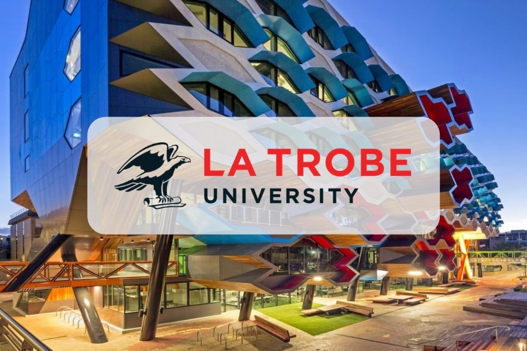

   
  

- **Dates**: Monday November 17 - Tuesday November 18, 2025. 
- **Venue**: La Trobe University City Campus, Melbourne.

The main aim of the annual Australian Algebra Conference is to foster communication between algebraists in Australia. We interpret algebra quite broadly, including areas such as topological algebra, algebraic logic, graph theory and coding theory. The conference is run by the [Australian Algebra Group](https://sites.google.com/a/ltumathstats.com/austalg/about-us), which is a special interest group of the [Australian Mathematical Society](https://austms.org.au/).

The conference has a proud tradition of encouraging talks by students: typically about one third of the talks are presented by students. The conference aims to provide graduate students in algebra with the opportunity to give their first public presentation in a relaxed and supportive environment. Each conference, the most outstanding student talk is awarded the [Gordon Preston Prize](https://sites.google.com/a/ltumathstats.com/austalg/gordon-preston-prize).

## Jump to
<a href="#schedule">Information</a> 
<a href="#inv-sp">Invited Speakers</a> 
<a href="#rego">Registration</a> 
<a href="#travel">Travel Support for Students</a> 
<a href="#dead">Deadlines</a> 
<a href="#talks">Talks</a> 
<a href="#them">Registered Participants</a> 
<a href="#us">Organisers</a> 

<h2 id="schedule">Information</h2>

The conference will be held at the La Trobe University City Campus, located on Level 3, 360 Collins Street, Melbourne VIC 3000.

This centrally located venue offers convenient access via bus, tram, and train, as it is situated in the heart of Melbourne’s Central Business District (CBD). A wide range of accommodation options, including hotels and hostels, are available nearby, along with numerous dining venues catering to various preferences and budgets.

All talks will be held in "room to be announced".

<h2 id="inv-sp">Invited Speakers</h2>

 Azeef Ajmal - Western Sydney University
 
 Nik Ruskuc - University of St Andrews
 
 Adam Thomas - University of Warwick

<h2 id="rego">Registration</h2>

Registration is now open; to register please fill in [this form](https://forms.office.com/r/Sxgz8yMc6Z).

Registration fees should be paid via bank transfer. 

**BSB:** 063-262

**Account:** 1007 1018

**Account name:** Victorian Algebra Group

Please include your first and last name in the payment description, and email your payment confirmation (e.g. pdf or sceenshot) to [Marcel Jackson](mailto:m.g.jackson@latrobe.edu.au?subject=Registration%20payment%20for%20AAC).

Please see below the conference registration fees.

<html>
<table class="unstyledTable">
<thead>
<tr>
<th>Category</th>
<th>Fee</th>
</tr>
</thead>
<tbody>
<tr>
<td>Students</td>
<td>$0</td>
</tr>
<tr>
<td>Members of the Australian Algebra Group (AAG)</td>
<td>$0</td>
</tr>
<tr>
<td>Members of AustMS but not AAG</td>
<td>$30</td>
</tr>
<tr>
<td>Non-members</td>
<td>$40</td>
</tr>
</tbody>
</table>
</html>

<h2 id="travel">Travel Support for Students</h2>

There is limited travel support available for students. If you would like to apply for this support, please email [Santi Barrera Acevedo](mailto:s.barreraacevedo@latrobe.edu.au?subject=Student%20funding%20application%20for%20AAC) with a letter of support from your supervisor and an approximate budget of your expenses. Please include what travel and conference support is being provided to you by your university or other external funding body.

The allocation of funding will be communicated to applicants before registration closes.

<!-- **To register, please fill in [this form](https://forms.gle/HifdrEdRzJRnovBd6).** -->

To register for travel support, please fill in [this form](https://forms.office.com/r/0cpZfR0e0T).

<h2 id="dead">Deadlines</h2>

**Travel support applications due:** 29th September 2025

**Registration closes:** 3rd November 2025

**Abstract deadline:** 3rd November 2025

<h2 id="talks">Talk Schedule</h2>

To be announced. 

Contributed talks are 20 minutes long, with an additional 5 minutes for questions and change of speaker.

## Gordon Preston Prize

The [Gordon Preston Prize](https://sites.google.com/a/ltumathstats.com/austalg/gordon-preston-prize) is awarded for the best presentation at the AAC given by a current student based at an Australian or overseas university. The presentations will be judged by a panel appointed by the executive committee. The winner of the prize will receive $300. [The Rules](https://sites.google.com/a/ltumathstats.com/austalg/rules-for-the-gordon-preston-prize) for the Gordon Preston Prize are available on the website of the Australian Algebra Group. 

<h2 id="them">Registered Participants</h2>

<table class="tg">
<thead>
  <tr>
    <th class="tg-0lax">Name</th>
    <th class="tg-0lax">Affiliation</th>
  </tr>
</thead>
<tbody>
  <tr>
    <td class="tg-7zrl">Azeef Ajmal</td>
    <td class="tg-7zrl">Western Sydney University</td>
  </tr>
           <tr>
    <td class="tg-7zrl">Reymond Akpanya</td>
    <td class="tg-7zrl">The University of Sydney</td>
  </tr>
  <tr>
    <td class="tg-7zrl">Brice Arrigo</td>
    <td class="tg-7zrl">The University of Melbourne</td>
  </tr>
      <tr>
    <td class="tg-7zrl">Santi Barrera Acevedo</td>
    <td class="tg-7zrl">La Trobe University</td>
  </tr>
    <tr>
    <td class="tg-7zrl">Michal Botur</td>
    <td class="tg-7zrl">Palacký University Olomouc</td>
  </tr>
   <tr>
    <td class="tg-7zrl">Luka Carroll</td>
    <td class="tg-7zrl">Western Sydney University</td>
  </tr>
    <tr>
    <td class="tg-7zrl">Greta Civani</td>
    <td class="tg-7zrl">The University of Melbourne</td>
  </tr>
        <tr>
    <td class="tg-7zrl">Graham Clarke</td>
    <td class="tg-7zrl">RMIT University</td>
  </tr>
  <tr>
    <td class="tg-7zrl">Brian Davey</td>
    <td class="tg-7zrl">La Trobe University</td>
  </tr>
  <tr>
    <td class="tg-7zrl">Heiko Dietrich</td>
    <td class="tg-7zrl">Monash University</td>
  </tr>
    <tr>
    <td class="tg-7zrl">Qian Ding</td>
    <td class="tg-7zrl">La Trobe University</td>
  </tr>
            <tr>
    <td class="tg-7zrl">James East</td>
    <td class="tg-7zrl">Western Sydney University</td>
  </tr>
   <tr>
    <td class="tg-7zrl">Murray Elder</td>
    <td class="tg-7zrl">University of Technology Sydney</td>
  </tr>
      <tr>
    <td class="tg-7zrl">Alex Elzenaar</td>
    <td class="tg-7zrl">Monash University</td>
  </tr>
      <tr>
    <td class="tg-7zrl">Fawwaz Fakhrurrozi</td>
    <td class="tg-7zrl">The University of Melbourne</td>
  </tr>
          <tr>
    <td class="tg-7zrl">Alexander Fish</td>
    <td class="tg-7zrl">The University of Sydney</td>
  </tr>
        <tr>
    <td class="tg-7zrl">Matthias Fresacher</td>
    <td class="tg-7zrl">Western Sydney University</td>
  </tr>
      <tr>
    <td class="tg-7zrl">Barry Gardner</td>
    <td class="tg-7zrl"></td>
  </tr>
    <tr>
    <td class="tg-7zrl">Stephen Glasby</td>
    <td class="tg-7zrl">University of Western Australia</td>
  </tr>
      <tr>
    <td class="tg-7zrl">Yusuf Hafidh</td>
    <td class="tg-7zrl">The University of Melbourne</td>
  </tr>
          <tr>
    <td class="tg-7zrl">Thomas Hammer</td>
    <td class="tg-7zrl">The University of Melbourne</td>
  </tr>
       <tr>
    <td class="tg-7zrl">Joshua Howie</td>
    <td class="tg-7zrl">Monash University</td>
  </tr>
          <tr>
    <td class="tg-7zrl">Clive Jackson</td>
    <td class="tg-7zrl"></td>
  </tr>
      <tr>
    <td class="tg-7zrl">Deborah Jackson</td>
    <td class="tg-7zrl">La Trobe University and Sydney University</td>
  </tr>
        <tr>
    <td class="tg-7zrl">Marcel Jackson</td>
    <td class="tg-7zrl">La Trobe University</td>
  </tr>
            <tr>
    <td class="tg-7zrl">Seethalakshmi Kayanattath</td>
    <td class="tg-7zrl">Australian National University</td>
  </tr>
          <tr>
    <td class="tg-7zrl">Finn Klein</td>
    <td class="tg-7zrl">The University of Sydney</td>
  </tr>
      <tr>
    <td class="tg-7zrl">Melissa Lee</td>
    <td class="tg-7zrl">Monash University</td>
  </tr>
          <tr>
    <td class="tg-7zrl">JS Lemay</td>
    <td class="tg-7zrl">Macquarie University</td>
  </tr>
        <tr>
    <td class="tg-7zrl">Shir Levav-Porat</td>
    <td class="tg-7zrl">Monash University</td>
  </tr>
       </tr>
      <td class="tg-7zrl">Mengfan Lyu</td>
    <td class="tg-7zrl">Western Sydney University</td>
  </tr>   
            <tr>
    <td class="tg-7zrl">Lavender Marshall</td>
    <td class="tg-7zrl">Monash University</td>
  </tr>
       <tr>
    <td class="tg-7zrl">Bailey McLellan</td>
    <td class="tg-7zrl">The University of Melbourne</td>
   </tr>
        <tr>
    <td class="tg-7zrl">Eileen Pan</td>
    <td class="tg-7zrl">Monash University</td>
  </tr>
      <tr>
    <td class="tg-7zrl">Phoenix Pham</td>
    <td class="tg-7zrl">The University of Melbourne</td>
  </tr>
          <tr>
    <td class="tg-7zrl">Anthony Pisani</td>
    <td class="tg-7zrl">Monash University</td>
  </tr>
        <tr>
    <td class="tg-7zrl">Tomasz Popiel</td>
    <td class="tg-7zrl">Monash University</td>
  </tr>
        <tr>
    <td class="tg-7zrl">John Power</td>
    <td class="tg-7zrl">Macquarie University</td>
  </tr>
        <tr>
    <td class="tg-7zrl">Devi Imulia Dian Primaskun</td>
    <td class="tg-7zrl">The University of Melbourne</td>
  </tr>
        <tr>
    <td class="tg-7zrl">Ganesha Lapenangga Putra</td>
    <td class="tg-7zrl">The University of Melbourne</td>
  </tr>
        <tr>
    <td class="tg-7zrl">Tao Qin</td>
    <td class="tg-7zrl">The University of Sydney</td>
  </tr>
    <tr>
    <td class="tg-7zrl">Nik Ruskuc</td>
    <td class="tg-7zrl">University of St Andrews</td>
  </tr>
          <tr>
    <td class="tg-7zrl">Snehinh Sen</td>
    <td class="tg-7zrl">Australian National University</td>
  </tr>
          <tr>
    <td class="tg-7zrl">Joshua Tan</td>
    <td class="tg-7zrl">University of Technology Sydney</td>
  </tr>
  <tr>
    <td class="tg-7zrl">Don Taylor</td>
    <td class="tg-7zrl">The University of Sydney</td>
  </tr>
            <tr>
    <td class="tg-7zrl">Adam Thomas</td>
    <td class="tg-7zrl">University of Warwick</td>
  </tr>
            <tr>
    <td class="tg-7zrl">Vandit Trivedi</td>
    <td class="tg-7zrl">Australian National University</td>
  </tr>
    <tr>
    <td class="tg-7zrl">Stefan Veldsman</td>
    <td class="tg-7zrl">Nelson Mandela University and La Trobe University</td>
  </tr>
    <tr>
    <td class="tg-7zrl">Joshua Walters</td>
    <td class="tg-7zrl">The University of Melbourne</td>
  </tr>
        <tr>
    <td class="tg-7zrl">Yu Wang</td>
    <td class="tg-7zrl">The University of Melbourne</td>
  </tr>
      <tr>
    <td class="tg-7zrl">Vindya Warnakulasooriyage</td>
    <td class="tg-7zrl">RMIT University</td>
  </tr>
        <tr>
    <td class="tg-7zrl">Bailey Whitbread</td>
    <td class="tg-7zrl">The University of Sydney</td>
  </tr>
  <tr>
    <td class="tg-7zrl">Jung Won Cho</td>
    <td class="tg-7zrl">University of St Andrews</td>
  </tr>
    <tr>
    <td class="tg-7zrl">Binzhou Xia</td>
    <td class="tg-7zrl">The University of Melbourne</td>
  </tr>
</tbody>
</table>

<h2 id="us">Organisers</h2>

- [Santi Barrera Acevedo](https://scholars.latrobe.edu.au/s2barreraace), La Trobe Unversity
- [Marcel Jackson](https://scholars.latrobe.edu.au/mgjackson), La Trobe Unversity
- [Olga Minchin](https://au.linkedin.com/in/olga-minchin-645743ba), La Trobe Unversity

<h2 id="diner">Conference Dinner</h2>

The conference (self-funded) dinner will be held at Stomping Ground Brewery (100 Gipps St, Collingwood 3066) on Monday, November 17, from 5:30 pm to 8:30 pm.

Stomping Ground offers a relaxed, welcoming atmosphere and has earned multiple awards, including Champion Medium Australian Brewery (AIBA 2024 & 2022) and Champion Australian Independent Large Brewery (Indies 2021).

<h2 id="photo">Conference Photo</h2>
